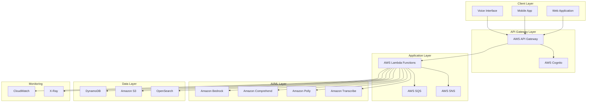
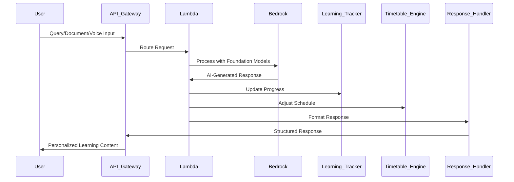

# Design Document: TechSaathi AI

## Overview

TechSaathi AI is a cloud-native, AI-powered learning and developer productivity platform built on AWS infrastructure with Amazon Bedrock at its core. The system provides personalized mentorship, multilingual technical education, and comprehensive learning analytics for students and developers across India.

The platform follows a microservices architecture with event-driven communication, enabling scalable, maintainable, and resilient operation. AWS Bedrock provides the foundational AI capabilities for natural language understanding, document processing, code analysis, and multilingual content generation.

## Architecture

### High-Level System Architecture



### AWS Bedrock Integration Flow



## Components and Interfaces

### Core Service Components

#### 1. Skill Detection Service
**Purpose**: Assess and track user technical proficiency levels
**Technology**: AWS Lambda + Amazon Bedrock Claude/Titan models
**Interfaces**:
- `assessSkillLevel(userId: string, responses: AssessmentResponse[]): SkillLevel`
- `updateSkillProgress(userId: string, topic: string, performance: number): void`
- `getSkillProfile(userId: string): SkillProfile`

#### 2. Multilingual Processing Service
**Purpose**: Handle content translation and localization
**Technology**: AWS Lambda + Amazon Bedrock + Amazon Translate
**Interfaces**:
- `translateContent(content: string, targetLanguage: string): TranslatedContent`
- `generateCulturalAnalogy(concept: string, language: string): Analogy`
- `localizeExplanation(explanation: string, userContext: UserContext): LocalizedExplanation`

#### 3. Document Processing Service
**Purpose**: Extract, analyze, and process educational documents
**Technology**: AWS Lambda + Amazon Bedrock + Amazon Textract
**Interfaces**:
- `extractDocumentContent(s3Key: string): DocumentContent`
- `generateSummary(content: DocumentContent, skillLevel: SkillLevel): Summary`
- `identifyKeyPoints(content: DocumentContent): KeyPoint[]`
- `answerDocumentQuestion(question: string, context: DocumentContent): Answer`

#### 4. Code Analysis Service
**Purpose**: Provide code explanation, debugging, and best practices
**Technology**: AWS Lambda + Amazon Bedrock CodeWhisperer integration
**Interfaces**:
- `explainCode(code: string, language: string, userSkillLevel: SkillLevel): CodeExplanation`
- `debugCode(code: string, error: string): DebuggingGuidance`
- `reviewCode(code: string): CodeReview`
- `suggestImprovements(code: string): Improvement[]`

#### 5. Learning Analytics Service
**Purpose**: Track progress, identify patterns, and generate insights
**Technology**: AWS Lambda + DynamoDB + Amazon QuickSight
**Interfaces**:
- `recordLearningActivity(userId: string, activity: LearningActivity): void`
- `analyzeProgress(userId: string, timeframe: TimeRange): ProgressAnalysis`
- `identifyWeakAreas(userId: string): WeakArea[]`
- `generateLearningInsights(userId: string): LearningInsights`

#### 6. Timetable Management Service
**Purpose**: Create and adapt personalized study schedules
**Technology**: AWS Lambda + DynamoDB + Amazon EventBridge
**Interfaces**:
- `generateTimetable(userId: string, goals: LearningGoal[], constraints: Constraint[]): Timetable`
- `adaptSchedule(userId: string, missedSessions: Session[]): UpdatedTimetable`
- `integrateExternalSchedule(userId: string, externalEvents: Event[]): void`
- `trackScheduleAdherence(userId: string): AdherenceMetrics`

#### 7. Question Bank Service
**Purpose**: Generate practice questions and evaluate responses
**Technology**: AWS Lambda + Amazon Bedrock + DynamoDB
**Interfaces**:
- `generateQuestions(topic: string, difficulty: Difficulty, count: number): Question[]`
- `evaluateAnswer(question: Question, userAnswer: string): Evaluation`
- `generateExplanation(question: Question, correctAnswer: string): Explanation`
- `createRevisionMaterial(userId: string, weakTopics: string[]): RevisionContent`

#### 8. Voice Interface Service
**Purpose**: Handle speech-to-text and text-to-speech interactions
**Technology**: AWS Lambda + Amazon Transcribe + Amazon Polly
**Interfaces**:
- `transcribeAudio(audioS3Key: string, language: string): TranscriptionResult`
- `synthesizeSpeech(text: string, language: string, voice: VoiceId): AudioS3Key`
- `processVoiceQuery(audioS3Key: string): ProcessedQuery`
- `generateVoiceResponse(response: string, userPreferences: VoicePreferences): AudioResponse`

### External Integrations

#### Amazon Bedrock Foundation Models
- **Claude 3 Sonnet**: Complex reasoning, code analysis, multilingual explanations
- **Titan Text**: Content generation, summarization, question answering
- **Cohere Command**: Multilingual content processing and cultural adaptation
- **AI21 Jurassic**: Technical writing and educational content creation

#### AWS Services Integration
- **API Gateway**: RESTful API management with rate limiting and authentication
- **Cognito**: User authentication and authorization with social login support
- **DynamoDB**: NoSQL database for user profiles, progress tracking, and session data
- **S3**: Document storage, audio files, and static content delivery
- **OpenSearch**: Full-text search for documents and learning content
- **EventBridge**: Event-driven architecture for real-time updates
- **CloudWatch**: Monitoring, logging, and alerting
- **X-Ray**: Distributed tracing for performance optimization

## Data Models

### User Profile Model
```typescript
interface UserProfile {
  userId: string;
  personalInfo: {
    name: string;
    email: string;
    preferredLanguage: string;
    location: string;
    educationLevel: string;
  };
  skillProfile: {
    overallLevel: SkillLevel;
    topicSkills: Map<string, SkillLevel>;
    lastAssessment: Date;
    progressHistory: ProgressPoint[];
  };
  preferences: {
    learningStyle: LearningStyle;
    voiceEnabled: boolean;
    notificationSettings: NotificationPreferences;
    culturalContext: CulturalContext;
  };
  goals: LearningGoal[];
  createdAt: Date;
  lastActive: Date;
}
```

### Learning Activity Model
```typescript
interface LearningActivity {
  activityId: string;
  userId: string;
  type: ActivityType; // 'document_study' | 'code_practice' | 'question_practice' | 'voice_interaction'
  topic: string;
  content: {
    input: string;
    response: string;
    explanation: string;
  };
  performance: {
    accuracy: number;
    timeSpent: number;
    difficultyLevel: Difficulty;
    completionStatus: CompletionStatus;
  };
  metadata: {
    language: string;
    skillLevelAtTime: SkillLevel;
    deviceType: string;
    sessionId: string;
  };
  timestamp: Date;
}
```

### Document Content Model
```typescript
interface DocumentContent {
  documentId: string;
  userId: string;
  metadata: {
    filename: string;
    fileType: string;
    uploadDate: Date;
    s3Key: string;
    size: number;
  };
  extractedContent: {
    rawText: string;
    structuredContent: ContentSection[];
    keyTerms: string[];
    topics: string[];
    difficulty: Difficulty;
  };
  processedContent: {
    summary: string;
    keyPoints: KeyPoint[];
    concepts: Concept[];
    practiceQuestions: Question[];
  };
  userInteractions: {
    questionsAsked: DocumentQuestion[];
    explanationsRequested: ExplanationRequest[];
    bookmarks: Bookmark[];
  };
}
```

### Timetable Model
```typescript
interface Timetable {
  timetableId: string;
  userId: string;
  period: {
    startDate: Date;
    endDate: Date;
    timezone: string;
  };
  goals: LearningGoal[];
  schedule: {
    sessions: StudySession[];
    milestones: Milestone[];
    bufferTime: number;
    adaptiveRules: AdaptationRule[];
  };
  constraints: {
    availableHours: TimeSlot[];
    blockedTimes: TimeSlot[];
    preferredStudyTimes: TimeSlot[];
    maxSessionDuration: number;
  };
  performance: {
    adherenceRate: number;
    completedSessions: number;
    missedSessions: number;
    adaptationHistory: AdaptationEvent[];
  };
  status: TimetableStatus;
  lastUpdated: Date;
}
```

### Code Analysis Model
```typescript
interface CodeAnalysis {
  analysisId: string;
  userId: string;
  code: {
    content: string;
    language: string;
    context: string;
  };
  analysis: {
    explanation: MultilingualExplanation;
    complexity: ComplexityMetrics;
    issues: CodeIssue[];
    suggestions: Improvement[];
    bestPractices: BestPractice[];
  };
  debugging: {
    errors: DetectedError[];
    solutions: Solution[];
    learningPoints: LearningPoint[];
  };
  skillLevel: SkillLevel;
  timestamp: Date;
}
```

Now I need to use the prework tool to analyze the acceptance criteria before writing the Correctness Properties section.

<function_calls>
<invoke name="prework">
<parameter name="featureName">techsaathi-ai


## Correctness Properties

*A property is a characteristic or behavior that should hold true across all valid executions of a system—essentially, a formal statement about what the system should do. Properties serve as the bridge between human-readable specifications and machine-verifiable correctness guarantees.*

### Property 1: Skill Assessment Categorization
*For any* new user completing skill assessment, the system should assign exactly one valid skill level category (beginner, intermediate, or advanced) based on their assessment responses.
**Validates: Requirements 1.1, 1.2**

### Property 2: Skill-Based Explanation Adaptation
*For any* technical explanation request, the complexity and terminology of the explanation should be inversely correlated with the user's skill level (beginner explanations simpler than advanced explanations).
**Validates: Requirements 1.3**

### Property 3: Skill Level Update on Progress
*For any* user demonstrating improved performance on learning activities, the skill detector should update proficiency ratings to reflect the improvement.
**Validates: Requirements 1.4**

### Property 4: Content Adaptation on Skill Change
*For any* user whose skill level changes, subsequent content recommendations and explanations should differ from those provided before the skill level change.
**Validates: Requirements 1.5**

### Property 5: Consistent Language Delivery
*For any* user with a set language preference, all system interactions (code explanations, responses, UI elements) should be delivered in that preferred language.
**Validates: Requirements 2.1, 2.4**

### Property 6: Cultural Analogy Inclusion
*For any* complex technical concept explanation in a local language, the explanation should contain at least one real-life analogy relevant to Indian cultural context.
**Validates: Requirements 2.2**

### Property 7: Technical Term Accuracy Preservation
*For any* technical term translated across languages, the core technical meaning should remain accurate and verifiable against standard technical definitions.
**Validates: Requirements 2.3**

### Property 8: Context Preservation Across Language Switch
*For any* ongoing conversation, switching the language preference mid-conversation should preserve the conversation context and topic continuity.
**Validates: Requirements 2.5**

### Property 9: Document Processing Completeness
*For any* uploaded PDF document, the document processor should extract text content, generate a structured summary, and identify at least one key technical concept.
**Validates: Requirements 3.1, 3.2**

### Property 10: Explanation Simplification
*For any* complex document content, the generated explanation should have lower complexity metrics (readability score, technical term density) than the original content.
**Validates: Requirements 3.3**

### Property 11: Contextual Answer Referencing
*For any* question about uploaded document content, the answer should contain explicit references to specific sections or concepts from the source document.
**Validates: Requirements 3.4**

### Property 12: Personalized Content Prioritization
*For any* two users with different skill levels viewing the same document, the highlighted key points should differ based on their respective skill levels and learning goals.
**Validates: Requirements 3.5**

### Property 13: Question Topic Relevance
*For any* practice question generation request, all generated questions should be semantically related to the specified study topics.
**Validates: Requirements 4.1**

### Property 14: Step-by-Step Solution Format
*For any* solution explanation, the response should be structured as a sequence of discrete steps in the user's preferred language.
**Validates: Requirements 4.2**

### Property 15: Answer Evaluation Completeness
*For any* submitted answer to a practice question, the system should provide both an evaluation (correct/incorrect/partial) and detailed feedback explaining the assessment.
**Validates: Requirements 4.3**

### Property 16: Weak Area Focus in Revision
*For any* generated revision material, the content should prioritize topics identified as weak areas in the user's learning history.
**Validates: Requirements 4.4**

### Property 17: Learning Activity Recording
*For any* completed learning activity, the learning tracker should create a persistent record containing topic, performance metrics, and timestamp.
**Validates: Requirements 5.1**

### Property 18: Progress Pattern Identification
*For any* progress analysis request, the system should identify and return both strength patterns (high-performing topics) and weakness patterns (low-performing topics).
**Validates: Requirements 5.2**

### Property 19: Comprehensive Progress Reporting
*For any* progress review request, the generated report should include visual representations, time-based skill development data, and actionable insights.
**Validates: Requirements 5.3, 5.5**

### Property 20: Targeted Weakness Recommendations
*For any* identified weak area, the learning tracker should recommend specific practice materials and study resources related to that weak topic.
**Validates: Requirements 5.4**

### Property 21: Constraint-Respecting Timetable Generation
*For any* timetable generation request with schedule constraints, all generated study sessions should fall within available time slots and respect blocked times and existing commitments.
**Validates: Requirements 6.1, 6.3**

### Property 22: Adaptive Rescheduling on Missed Sessions
*For any* missed study session, the timetable engine should automatically generate an updated schedule that rebalances remaining sessions while maintaining goal deadlines.
**Validates: Requirements 6.2**

### Property 23: Milestone-Based Learning Path Creation
*For any* set of learning goals, the generated timetable should include milestone markers that partition the learning path into measurable progress checkpoints.
**Validates: Requirements 6.4**

### Property 24: Schedule Adaptation on Progress Deviation
*For any* detected deviation from planned progress (ahead or behind schedule), the timetable engine should adjust future session scheduling to maintain goal achievement timelines.
**Validates: Requirements 6.5**

### Property 25: Error Identification in Code
*For any* submitted code containing syntax or logical errors, the code explainer should identify at least one issue and provide a clear explanation of the problem.
**Validates: Requirements 7.1**

### Property 26: Comprehensive Code Review
*For any* code review request, the system should analyze code quality and provide both best practice suggestions and constructive feedback with explanations.
**Validates: Requirements 7.3, 7.4**

### Property 27: Step-by-Step Solution Reasoning
*For any* debugging or code solution explanation, the response should follow a step-by-step reasoning structure that builds understanding progressively.
**Validates: Requirements 7.5**

### Property 28: Speech-to-Text Conversion
*For any* voice input audio file, the voice interface should produce a text transcription that can be processed as a query.
**Validates: Requirements 8.1**

### Property 29: Technical Term Pronunciation Accuracy
*For any* technical term in a voice response, the pronunciation should match standard pronunciation guides for that term in the chosen language.
**Validates: Requirements 8.3**

### Property 30: Accessibility Alternative Methods
*For any* user with indicated accessibility needs, the voice interface should provide alternative interaction methods (text-based, visual cues, etc.).
**Validates: Requirements 8.4**

### Property 31: Clarification Request on Poor Audio
*For any* voice input with low confidence scores or poor audio quality, the system should request clarification while maintaining the conversation context.
**Validates: Requirements 8.5**

### Property 32: Complete Data Deletion
*For any* user data deletion request, querying for that user's personal information across all system components should return no results after deletion completes.
**Validates: Requirements 10.4**

### Property 33: Skill-Based Project Idea Relevance
*For any* project idea generation request, all suggested projects should match the user's current skill level and stated interests.
**Validates: Requirements 11.1**

### Property 34: Technology Stack-Specific Guidance
*For any* coding guidance request, the best practices and recommendations should be specific to the user's declared technology stack.
**Validates: Requirements 11.2**

### Property 35: Pomodoro Timing Pattern
*For any* activated focus mode session, the timing intervals should follow the Pomodoro technique pattern (work intervals followed by break intervals).
**Validates: Requirements 11.3**

### Property 36: Code Pattern Improvement Suggestions
*For any* code pattern review, the system should suggest at least one improvement and provide reasoning explaining why the improvement is beneficial.
**Validates: Requirements 11.4**

### Property 37: Usage Pattern-Based Productivity Advice
*For any* productivity advice request, the recommendations should reference and be derived from the user's actual usage patterns and behavior history.
**Validates: Requirements 11.5**

### Property 38: Document Format Validation
*For any* document parsing attempt, the system should validate the input against supported format specifications before processing.
**Validates: Requirements 12.1**

### Property 39: Descriptive Error Messages for Invalid Documents
*For any* invalid or unsupported document input, the system should return an error message that describes what is invalid and what formats are supported.
**Validates: Requirements 12.2**

### Property 40: Document Processing Round-Trip
*For any* valid document object, parsing then formatting then parsing should produce a structured data representation equivalent to the original parsed result.
**Validates: Requirements 12.4**

### Property 41: Code Formatting Preservation
*For any* processed code file, the formatted output should maintain proper syntax highlighting markers and indentation structure from the input.
**Validates: Requirements 12.5**

## Error Handling

### Error Categories and Handling Strategies

#### 1. Input Validation Errors
**Scenarios**: Invalid document formats, malformed code, unsupported languages
**Handling**:
- Validate all inputs against schemas before processing
- Return descriptive error messages with guidance on correct format
- Log validation failures for monitoring
- Provide fallback suggestions when possible

#### 2. AI Model Errors
**Scenarios**: Bedrock API failures, timeout errors, rate limiting
**Handling**:
- Implement exponential backoff retry logic (3 attempts)
- Use circuit breaker pattern to prevent cascade failures
- Fallback to cached responses for common queries
- Queue requests during high load periods
- Alert monitoring systems on repeated failures

#### 3. Data Processing Errors
**Scenarios**: Document extraction failures, corrupted files, encoding issues
**Handling**:
- Attempt multiple extraction methods (Textract, OCR, text parsing)
- Detect and handle different character encodings
- Provide partial results when complete processing fails
- Store failed documents for manual review
- Return user-friendly error messages

#### 4. Authentication and Authorization Errors
**Scenarios**: Invalid tokens, expired sessions, insufficient permissions
**Handling**:
- Return 401 for authentication failures with refresh token guidance
- Return 403 for authorization failures with clear permission requirements
- Implement token refresh logic before expiration
- Log security-related errors for audit
- Rate limit failed authentication attempts

#### 5. Resource Availability Errors
**Scenarios**: Database connection failures, S3 unavailability, service outages
**Handling**:
- Implement health checks for all dependencies
- Use multi-AZ deployment for high availability
- Cache frequently accessed data in ElastiCache
- Provide degraded functionality during partial outages
- Display system status to users during incidents

#### 6. User Input Errors
**Scenarios**: Empty queries, unclear voice input, ambiguous questions
**Handling**:
- Request clarification with specific prompts
- Suggest example queries or formats
- Use conversation context to disambiguate
- Provide "did you mean" suggestions
- Maintain conversation flow during error recovery

### Error Response Format

All errors follow a consistent JSON structure:

```json
{
  "error": {
    "code": "ERROR_CODE",
    "message": "User-friendly error description",
    "details": {
      "field": "specific_field_name",
      "reason": "detailed_technical_reason"
    },
    "suggestions": [
      "Try uploading a PDF file instead",
      "Ensure the file size is under 10MB"
    ],
    "timestamp": "2024-01-15T10:30:00Z",
    "requestId": "req_abc123"
  }
}
```

## Testing Strategy

### Dual Testing Approach

TechSaathi AI requires both unit testing and property-based testing to ensure comprehensive correctness validation. These approaches are complementary:

- **Unit tests** validate specific examples, edge cases, and error conditions
- **Property tests** verify universal properties across all possible inputs
- Together they provide confidence in both specific behaviors and general correctness

### Property-Based Testing Implementation

**Framework Selection**: 
- **Python**: Hypothesis library for Lambda functions and backend services
- **TypeScript**: fast-check library for frontend and API layer
- **Configuration**: Minimum 100 iterations per property test to ensure thorough randomized input coverage

**Property Test Structure**:
Each correctness property from the design document must be implemented as a property-based test with the following tag format:

```python
# Feature: techsaathi-ai, Property 1: Skill Assessment Categorization
@given(assessment_responses=st.lists(st.assessment_response()))
def test_skill_assessment_categorization(assessment_responses):
    # Test implementation
```

**Key Property Test Areas**:

1. **Skill Assessment Properties (Properties 1-4)**
   - Generate random user profiles and assessment responses
   - Verify skill level categorization validity
   - Test explanation complexity adaptation
   - Validate skill level updates on progress

2. **Multilingual Processing Properties (Properties 5-8)**
   - Generate random content in multiple languages
   - Verify language consistency across interactions
   - Test cultural analogy inclusion
   - Validate technical term accuracy preservation

3. **Document Processing Properties (Properties 9-12)**
   - Generate random PDF documents with varying complexity
   - Test extraction completeness
   - Verify explanation simplification
   - Validate personalized content prioritization

4. **Question Bank Properties (Properties 13-16)**
   - Generate random topics and difficulty levels
   - Test question relevance to topics
   - Verify solution format structure
   - Validate answer evaluation completeness

5. **Learning Analytics Properties (Properties 17-20)**
   - Generate random learning activity sequences
   - Test activity recording persistence
   - Verify pattern identification
   - Validate recommendation relevance

6. **Timetable Properties (Properties 21-24)**
   - Generate random schedules with constraints
   - Test constraint satisfaction
   - Verify adaptive rescheduling
   - Validate milestone creation

7. **Code Analysis Properties (Properties 25-27)**
   - Generate random code samples with errors
   - Test error identification
   - Verify review completeness
   - Validate step-by-step reasoning structure

8. **Voice Interface Properties (Properties 28-31)**
   - Generate random audio inputs
   - Test speech-to-text conversion
   - Verify pronunciation accuracy
   - Validate clarification requests

9. **Round-Trip Properties (Property 40)**
   - Critical for document parsing correctness
   - Generate random valid documents
   - Test: parse → format → parse produces equivalent result
   - This catches serialization bugs that unit tests miss

### Unit Testing Strategy

**Focus Areas for Unit Tests**:

1. **Specific Example Tests**
   - Test known good inputs produce expected outputs
   - Validate specific user scenarios and workflows
   - Test integration between components

2. **Edge Case Tests**
   - Empty inputs, null values, boundary conditions
   - Maximum file sizes, character limits
   - Extreme skill levels, unusual language combinations
   - Timezone edge cases, daylight saving transitions

3. **Error Condition Tests**
   - Invalid document formats
   - Malformed API requests
   - Authentication failures
   - Service unavailability scenarios
   - Rate limiting triggers

4. **Integration Tests**
   - AWS Bedrock API integration
   - DynamoDB read/write operations
   - S3 document upload/download
   - API Gateway request routing
   - Cognito authentication flows

**Test Coverage Goals**:
- Minimum 80% code coverage for business logic
- 100% coverage for critical paths (authentication, data deletion, payment processing)
- All error handling paths must have explicit tests

### Testing Infrastructure

**Test Environment**:
- Separate AWS account for testing
- Mock Bedrock responses for fast unit tests
- Integration test environment with real AWS services
- Automated test execution on every commit (CI/CD)

**Performance Testing**:
- Load testing with 1000+ concurrent users
- Stress testing to identify breaking points
- Latency testing for API response times (target: <500ms p95)
- Document processing performance benchmarks

**Security Testing**:
- Penetration testing for API endpoints
- SQL injection and XSS vulnerability scanning
- Authentication and authorization testing
- Data encryption verification
- Privacy compliance validation

### Continuous Testing

**CI/CD Pipeline**:
1. On commit: Run unit tests and fast property tests (10 iterations)
2. On PR: Run full property tests (100 iterations) and integration tests
3. On merge: Run full test suite including performance tests
4. Nightly: Run extended property tests (1000 iterations) and security scans

**Monitoring and Alerting**:
- Real-time error rate monitoring
- Performance degradation alerts
- Failed test notifications
- Coverage regression alerts